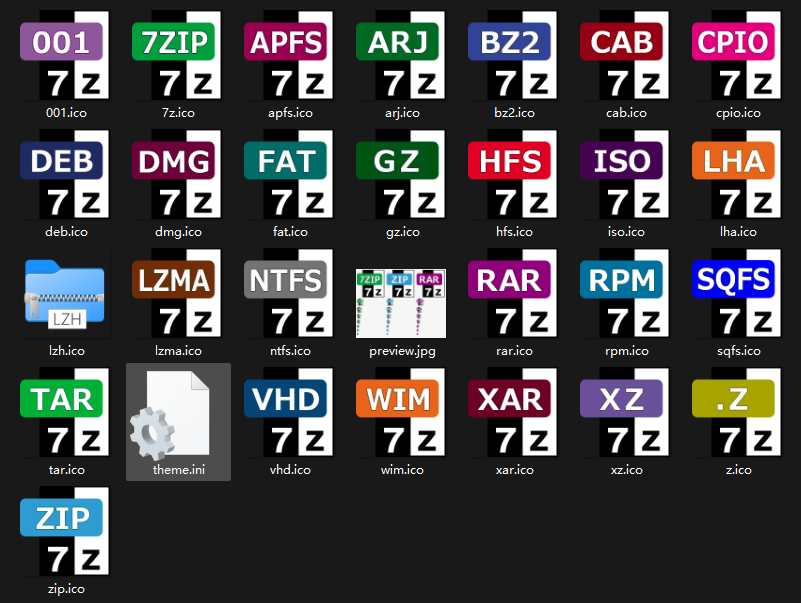

# Better 7 Zip Build

这是一个为7zip提供编译脚本的项目，灵感来自[
MoreModern7Zip
](https://github.com/YukiIsait/MoreModern7Zip)和[7ZipBuilder](https://github.com/YukiIsait/7ZipBuilder) 但是由于这个仓库的作者写的脚本个性化比较重(变量太多了看不过来), 所以我自己写了一个新的  

除此之外, 我们可以使用更好的[7zip-zstd](https://github.com/mcmilk/7-Zip-zstd), 它提供更好的算法  

除了7ZipBuilder作者给的一套图标外 我自己额外加了一套简约风格的图标, 来自7zTC  

Preview:


# Usage

运行:
```shell
git submodule init
git submodule update --recursive --remote
./run.ps1
```
即可在等待几分钟后在根目录找到安装文件

# 脚本变量设置
``run.ps1``的头部为:  

```ps1
$buildVersion = 'FastZip-7zstd-2409'
$PLATFORM = "x64"
$SUBSYS = "5.02"
```

buildVersion为输出安装包的名称 PLATFORM指定架构，你也可以设置为x86 SUBSYS与架构有关, 详情自行百度  

理论上可以进行arm架构的构建, 需要修改脚本中32位shell扩展构建的部分, 考虑使用范围较小, 感兴趣者可以自行查阅  

[7zip-zstd](https://github.com/mcmilk/7-Zip-zstd)采用子模块形式添加到仓库中, 可以更换为7zip官方代码, 你也可以拉取后自行定制(这并不被推荐, 因为脚本的头部逻辑为直接删除原有的构建产物, 重复构建会很耗时)  

# 开源许可

本项目采用 MIT 许可证，详见[许可文件](LICENSE.md)  
7-Zip 项目采用 GNU LGPL、BSD 3 以及 unRAR 许可证，详见[许可文件](https://www.7-zip.org/license.txt)  
